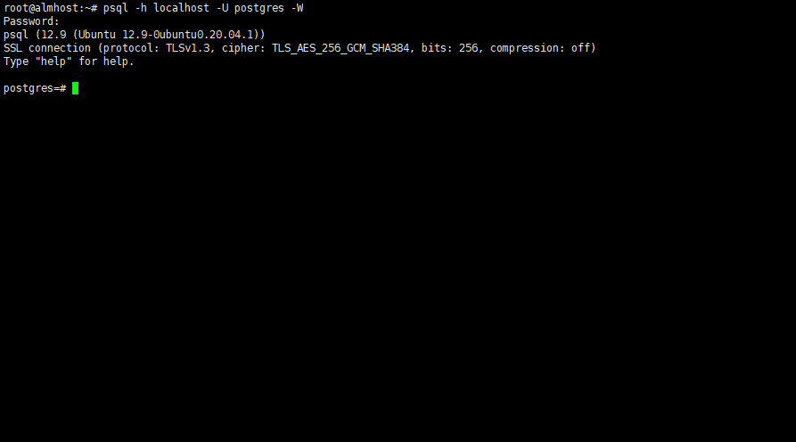
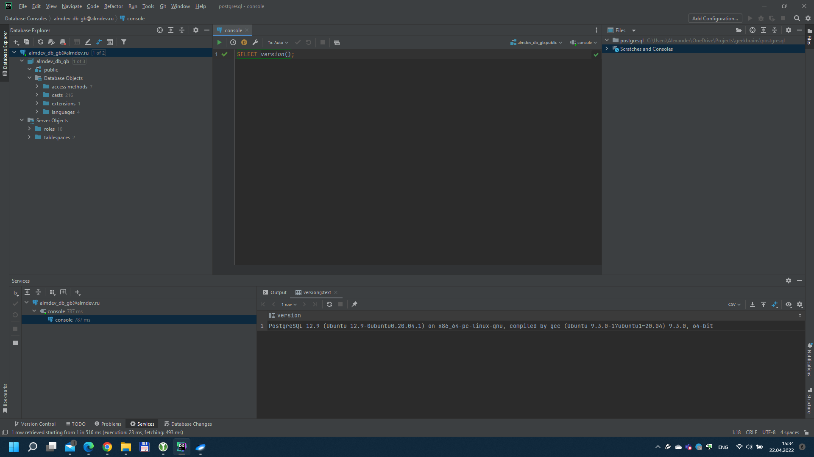

1. Установить PostgreSQL на виртуальную машину с Linux, настроить подключение консольным клиентом psql.

2. Установить программу pgAdmin на основную систему и настроить подключение к PostgreSQL на виртуальной машине через туннель SSH.
Можно я буду использовать DataGrip?

